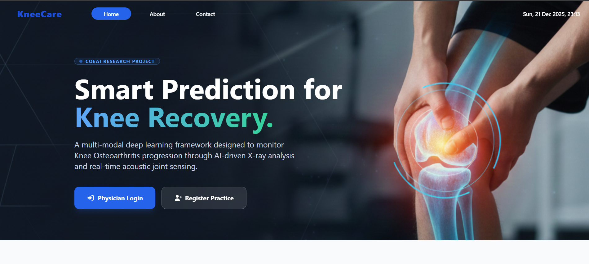

# 🛡️ KneeCare: Smart Prediction for Knee Recovery

**A Multi-Modal Deep Learning Framework for Knee Osteoarthritis (KOA) Monitoring.**

KneeCare is a cutting-edge medical platform designed to monitor and predict the progression of Knee Osteoarthritis. By combining **AI-driven X-ray analysis (KL Grading)** with **Real-time IoT Acoustic Sensing (Vibroarthrography)**, it provides physicians with a comprehensive tool for early intervention and personalized recovery plans.

---

## 🚀 Key Features

* **Multi-Modal AI Engine:** Integrates radiographic data (X-rays) with biomechanical acoustic signals.
* **IoT VAG Sensor Integration:** Real-time collection of joint vibration and thermal data via wearable sensors.
* **Automated KL Grading:** AI-powered classification of OA severity (Stages 0–4).
* **Explainable AI (XAI):** Generates heatmaps to show clinicians exactly which joint areas are showing signs of decay.
* **Dynamic Treatment Dashboards:** Visualize recovery trends and automate risk alerts for potential complications.

---

## 🏗️ System Architecture

1. **Data Acquisition:** Patient X-rays and IoT wearable sensor signals.  
2. **Preprocessing:** Signal denoising and image normalization using Deep Learning.  
3. **Feature Extraction:** Extracting radiographic features and acoustic spectral signatures.  
4. **Inference Layer:** Multi-modal fusion model predicts the recovery trajectory.  
5. **Clinician Interface:** Dashboard for physician review and prescription management.  

---

## 🛠️ Tech Stack

* **Frontend:** React.js, Tailwind CSS, Framer Motion  
* **Backend:** Node.js / Python (FastAPI/Flask for AI Model serving)  
* **Animations:** Framer Motion & Intersection Observer  
* **Icons:** FontAwesome  
* **AI Models:** CNNs for Imaging + RNN/LSTMs for VAG signals  

---

## 📦 Installation & Setup

### 1. Clone the Repository
```bash
git clone https://github.com/YourUsername/KneeCare.git
cd KneeCare
```

---

### 2. Install Node.js & Python Dependencies

**Backend (Node.js + Python ML):**
```bash
cd koa360-backend
npm install                # Install Node.js dependencies

# Create and activate Python virtual environment
python -m venv venv
# On Windows:
venv\Scripts\activate
# On macOS/Linux:
source venv/bin/activate

# Install Python requirements
pip install -r requirements.txt
```

**Frontend (React Dashboard):**
```bash
cd ../koa360-dashboard
npm install
```

---

### 3. Upload ESP32 Code
- Open `ESP32/KOA360.ino` in Arduino IDE or PlatformIO.  
- Select **ESP32 board** and upload the code to your device.  

---

### 4. Start Backend
```bash
cd koa360-backend
node server.js
```

---

### 5. Start Frontend
```bash
cd koa360-dashboard
npm start
```
Runs the dashboard at `http://localhost:3000`.

---

### 6. Install VS Code Extensions
If you saved your extensions list (`extensions.txt`):
```bash
cat extensions.txt | xargs -n 1 code --install-extension
```

---

### 7. Activate Python venv & Install Requirements (if not already done)
```bash
cd koa360-backend
python -m venv venv
source venv/bin/activate   # or venv\Scripts\activate on Windows
pip install -r requirements.txt
```

---

### ⚡ Quick Start (Frontend Only)
If you just want to run the dashboard quickly:
```bash
cd koa360-dashboard
npm install && npm start
```

---

## 📸 Component Screenshots



* **Dashboard:** Monitoring KL stages.  
* **IoT Section:** Real-time VAG signal visualization.  

---

## 📜 Research Credits

Developed under the **Centre of Excellence for AI (CoEAI)** as a specialized research project in biomechanical health monitoring.
